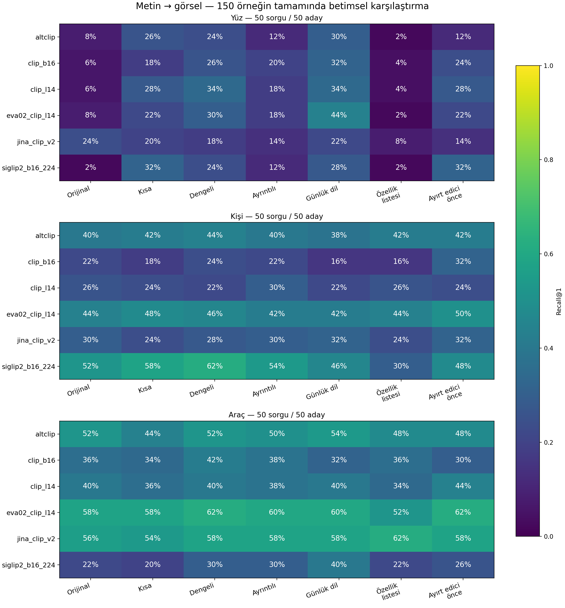
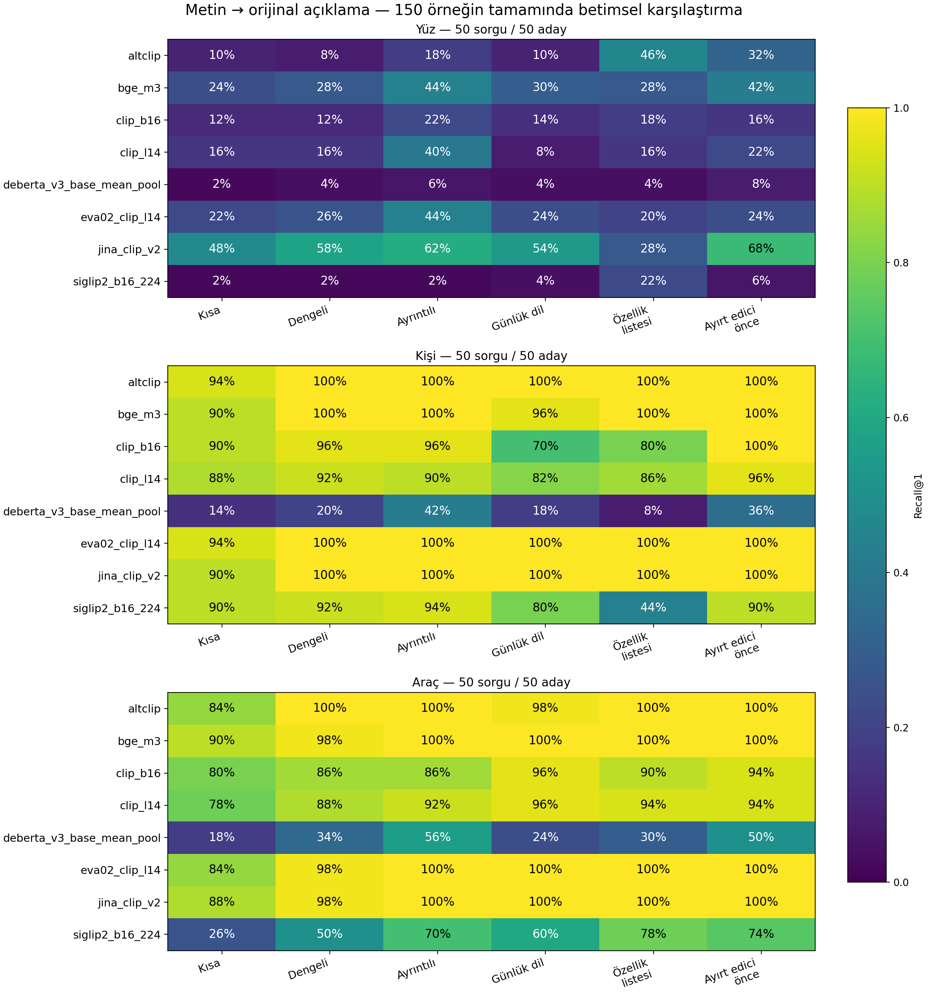

# Caption değişiklikleri encoder ve retrieval sonucunu nasıl etkiliyor?

150 görsel, 900 Gemini caption, 8 text encoder ve 6 hizalanmış vision–text çifti. Tamamlanan çalışma • 6 Ekim 2026. Ölçülen görev aynı kaynak metin/fotoğrafı bulmadır; farklı kamera veya pozlar arasında kimlik ReID değildir.

## 1. Bu çalışmadan elde ettiğimiz çıktı

Caption dönüşümlerini iki ayrı ölçümle karşılaştırdık: orijinal–varyant cosine ve kaynak caption ayrımı, ayrıca doğru görselin retrieval sırası. Böylece metin yakınlığının tek başına başarı olmadığını ve hangi caption profilinin hangi encoder/kategoride işe yaradığını sayısal olarak raporlayabiliyoruz. BGE-M3 ve DeBERTa text-only sonuç verir; bu iki model için görsel başarısı iddia etmiyoruz.

En açık örneklerden biri yüz caption’ları: CLIP L/14 için geliştirmede seçilen gündelik anlatım, ayrılmış sorgularda doğru görseli ilk sırada bulmayı 4%’ten 44%’e taşıyor. İnsan ve taşıtta her dönüşüm aynı kazanımı getirmiyor. Dolayısıyla özetlemenin etkisi var, fakat evrensel bir en iyi uzunluk veya profil yok.

Yüksek cosine’ın sınırı: DeBERTa’nın dengeli yüz caption’larında orijinale ortalama yakınlığı 0.954, fakat kaynak caption’ı ilk sırada bulma oranı 4%. Bu ham mean-pooling kullanımında yakınlık skoru ayırt edicilik yerine geçmiyor; bulgu bütün DeBERTa tabanlı embedding modellerine genellenmemelidir.

## 2. Deney tasarımı ve okunacak ölçüler

| Bileşen | Uygulama |
| --- | --- |
| Veri | 50 yüz + 50 insan + 50 taşıt; kategori başına 50 aday |
| Caption | Orijinal + 6 Gemini profili; kesin kelime sınırı yok; Gemini görüntüyü görmez |
| Kontrol | 229 tek-ifade kontrolü; dengeli caption üzerinden üretilir |
| Seçim | Kategori başına 25 geliştirme sorgusu; pilot örnekleri bu grupta |
| Değerlendirme | Kategori başına diğer 25 sorgu; galeri yine aynı 50 kaynak dosyası |
| R@1 / R@5 | Doğru kaynak/görselin ilk sırada / ilk beşte bulunma oranı |
| Margin | Doğru aday skoru − en güçlü rakip skoru; pozitif ise doğru aday öndedir |
| Cosine | Metin temsilindeki değişim; modeller arasında ortak başarı ölçeği değildir |

Tek Gemini üretimi/seed var. Profiller yalnızca uzunluğu değil, bilgi seçimini, ifade biçimini ve özellik sırasını da değiştiriyor. Sonuçları salt uzunluk etkisi veya promptun bağımsız nedensel etkisi olarak yorumlayamayız. Ayrılmış sorgular aynı veri havuzunun içindedir; bağımsız dış veri veya kimlik split’i değildir.

## 3. Caption görseli bulmayı ne kadar değiştirdi?

Her model için caption tarifi geliştirme sorgularında seçildi. Aşağıda aynı 25 ayrılmış sorguda orijinalle eşleştirilmiş karşılaştırması var. pp yüzde puandır; fark aralığı 2.000 eşleştirilmiş bootstrap örneklemesidir. Aralık sıfırı kapsıyorsa net iyileşme iddiası kurmayın. Çoklu karşılaştırma düzeltmesi yapılmamıştır.

| Kategori | Model | Geliştirmede seçilen tarif | Orijinal ilk sıra | Seçilen ilk sıra | Fark | Fark %95 aralık |
| --- | --- | --- | --- | --- | --- | --- |
| Yüz | AltCLIP | Gündelik anlatım | 4/25 | 10/25 | +24 pp | +0…+48 pp |
| Yüz | CLIP B/16 | Gündelik anlatım | 1/25 | 9/25 | +32 pp | +12…+52 pp |
| Yüz | CLIP L/14 | Gündelik anlatım | 1/25 | 11/25 | +40 pp | +20…+60 pp |
| Yüz | EVA02-CLIP | Gündelik anlatım | 2/25 | 16/25 | +56 pp | +36…+76 pp |
| Yüz | Jina-CLIP-v2 | Gündelik anlatım | 9/25 | 8/25 | -4 pp | -24…+16 pp |
| Yüz | SigLIP2 | Gündelik anlatım | 1/25 | 8/25 | +28 pp | +12…+44 pp |
| İnsan | AltCLIP | Kısa | 11/25 | 9/25 | -8 pp | -24…+8 pp |
| İnsan | CLIP B/16 | Ayırt edici önce | 4/25 | 7/25 | +12 pp | +0…+28 pp |
| İnsan | CLIP L/14 | Detaylı | 7/25 | 8/25 | +4 pp | -8…+20 pp |
| İnsan | EVA02-CLIP | Ayırt edici önce | 11/25 | 13/25 | +8 pp | -8…+24 pp |
| İnsan | Jina-CLIP-v2 | Orijinal | 6/25 | 6/25 | +0 pp | +0…+0 pp |
| İnsan | SigLIP2 | Dengeli | 15/25 | 15/25 | +0 pp | -20…+20 pp |
| Taşıt | AltCLIP | Dengeli | 13/25 | 12/25 | -4 pp | -16…+8 pp |
| Taşıt | CLIP B/16 | Dengeli | 9/25 | 11/25 | +8 pp | -8…+24 pp |
| Taşıt | CLIP L/14 | Dengeli | 10/25 | 10/25 | +0 pp | -16…+16 pp |
| Taşıt | EVA02-CLIP | Gündelik anlatım | 15/25 | 15/25 | +0 pp | -12…+12 pp |
| Taşıt | Jina-CLIP-v2 | Dengeli | 16/25 | 15/25 | -4 pp | -12…+0 pp |
| Taşıt | SigLIP2 | Gündelik anlatım | 7/25 | 14/25 | +28 pp | +8…+48 pp |

## 4. Kısa, dengeli ve uzun caption: aynı modeli sabit tutunca

| CLIP L/14 · 50 sorgu | Orijinal | Kısa | Dengeli | Detaylı | Gündelik | Özellik listesi | Ayırt edici önce |
| --- | --- | --- | --- | --- | --- | --- | --- |
| Yüz | 6% | 28% | 34% | 18% | 34% | 4% | 28% |
| İnsan | 26% | 24% | 22% | 30% | 22% | 26% | 24% |
| Taşıt | 40% | 36% | 40% | 38% | 40% | 34% | 44% |

Bu tablo tüm 50 sorgunun betimsel karşılaştırmasıdır; en yüksek hücreyi seçip bağımsız test başarısı diye sunmuyoruz. Yukarıdaki ayrılmış sorgu tablosu seçim sonrası değerlendirmedir.

CLIP L/14 ile betimsel yüz örneği: orijinal R@1 6%; en yüksek gözlenen üretilmiş profil Dengeli ile 34%. Eşleştirilmiş fark +28 yüzde puan; %95 bootstrap aralığı +16…+40 yüzde puan. Bu profil bu tablonun sonucuna bakılarak seçildiği için keşifsel bir örnektir.

CLIP L/14 ile betimsel i̇nsan örneği: orijinal R@1 26%; en yüksek gözlenen üretilmiş profil Detaylı ile 30%. Eşleştirilmiş fark +4 yüzde puan; %95 bootstrap aralığı -6…+14 yüzde puan. Bu profil bu tablonun sonucuna bakılarak seçildiği için keşifsel bir örnektir.

CLIP L/14 ile betimsel taşıt örneği: orijinal R@1 40%; en yüksek gözlenen üretilmiş profil Ayırt edici önce ile 44%. Eşleştirilmiş fark +4 yüzde puan; %95 bootstrap aralığı -4…+12 yüzde puan. Bu profil bu tablonun sonucuna bakılarak seçildiği için keşifsel bir örnektir.

## 5. Kısa ve uzun caption’ların vektörleri ne kadar yakın?

Hücreler: orijinal–varyant ortalama cosine / kaynak caption R@1. 50 sorgu üzerindeki metin sonuçlarıdır. Yüksek cosine ile düşük kaynak R@1 birlikte görülebilir: rakip metinler de aynı derecede yakın olabilir. Detaylı metnin daha yakın olması retrieval üstünlüğünü tek başına kanıtlamaz.

| Kategori | Encoder | Kısa cosine / kaynak R@1 | Dengeli cosine / kaynak R@1 | Detaylı cosine / kaynak R@1 |
| --- | --- | --- | --- | --- |
| Yüz | AltCLIP | 0.598 / 10% | 0.615 / 8% | 0.760 / 18% |
| İnsan | AltCLIP | 0.893 / 94% | 0.969 / 100% | 0.975 / 100% |
| Taşıt | AltCLIP | 0.857 / 84% | 0.934 / 100% | 0.954 / 100% |
| Yüz | BGE-M3 | 0.755 / 24% | 0.814 / 28% | 0.884 / 44% |
| İnsan | BGE-M3 | 0.892 / 90% | 0.958 / 100% | 0.965 / 100% |
| Taşıt | BGE-M3 | 0.848 / 90% | 0.930 / 98% | 0.951 / 100% |
| Yüz | CLIP B/16 | 0.782 / 12% | 0.801 / 12% | 0.882 / 22% |
| İnsan | CLIP B/16 | 0.895 / 90% | 0.950 / 96% | 0.953 / 96% |
| Taşıt | CLIP B/16 | 0.812 / 80% | 0.847 / 86% | 0.850 / 86% |
| Yüz | CLIP L/14 | 0.693 / 16% | 0.722 / 16% | 0.840 / 40% |
| İnsan | CLIP L/14 | 0.854 / 88% | 0.920 / 92% | 0.923 / 90% |
| Taşıt | CLIP L/14 | 0.792 / 78% | 0.828 / 88% | 0.827 / 92% |
| Yüz | DeBERTa (mean pool) | 0.938 / 2% | 0.954 / 4% | 0.977 / 6% |
| İnsan | DeBERTa (mean pool) | 0.973 / 14% | 0.981 / 20% | 0.981 / 42% |
| Taşıt | DeBERTa (mean pool) | 0.940 / 18% | 0.970 / 34% | 0.975 / 56% |
| Yüz | EVA02-CLIP | 0.716 / 22% | 0.750 / 26% | 0.846 / 44% |
| İnsan | EVA02-CLIP | 0.857 / 94% | 0.947 / 100% | 0.955 / 100% |
| Taşıt | EVA02-CLIP | 0.807 / 84% | 0.876 / 98% | 0.904 / 100% |
| Yüz | Jina-CLIP-v2 | 0.833 / 48% | 0.886 / 58% | 0.927 / 62% |
| İnsan | Jina-CLIP-v2 | 0.916 / 90% | 0.983 / 100% | 0.989 / 100% |
| Taşıt | Jina-CLIP-v2 | 0.904 / 88% | 0.951 / 98% | 0.967 / 100% |
| Yüz | SigLIP2 | 0.818 / 2% | 0.848 / 2% | 0.896 / 2% |
| İnsan | SigLIP2 | 0.850 / 90% | 0.911 / 92% | 0.917 / 94% |
| Taşıt | SigLIP2 | 0.839 / 26% | 0.876 / 50% | 0.901 / 70% |

## 6. Token sınırı ve tek-olgu kontrolleri

| Model | Kategori | Orijinal kesilme | Kısa kesilme | Dengeli kesilme | Detaylı kesilme |
| --- | --- | --- | --- | --- | --- |
| CLIP B/16 | Yüz | 100% | 0% | 0% | 76% |
| CLIP B/16 | İnsan | 0% | 0% | 0% | 2% |
| CLIP B/16 | Taşıt | 0% | 0% | 0% | 0% |
| CLIP L/14 | Yüz | 100% | 0% | 0% | 76% |
| CLIP L/14 | İnsan | 0% | 0% | 0% | 2% |
| CLIP L/14 | Taşıt | 0% | 0% | 0% | 0% |
| SigLIP2 | Yüz | 100% | 0% | 2% | 94% |
| SigLIP2 | İnsan | 2% | 0% | 0% | 2% |
| SigLIP2 | Taşıt | 0% | 0% | 0% | 0% |
| EVA02-CLIP | Yüz | 100% | 0% | 0% | 76% |
| EVA02-CLIP | İnsan | 0% | 0% | 0% | 2% |
| EVA02-CLIP | Taşıt | 0% | 0% | 0% | 0% |

Full150 koşusunda yerel token sınırını aşan metinler kesilerek işlendi. Bu modellerde uzun caption sonuçları bütün metne ait değildir. Bilgi kaybı, ifade değişikliği ve truncation etkileri birlikte bulunur. Önceki chunking pilotu ayrıdır; full150 için truncation/chunking ablation’ı yapılmış sayılmaz.

| Model | Eşleştirilmiş kontrol | Ortalama cosine farkı | Koruyan değişiklik daha yakın | Eşitlik |
| --- | --- | --- | --- | --- |
| AltCLIP | 85 | +0.0920 | 100% | 0% |
| BGE-M3 | 85 | +0.0236 | 85% | 0% |
| CLIP B/16 | 85 | +0.0595 | 92% | 0% |
| CLIP L/14 | 85 | +0.0773 | 92% | 0% |
| DeBERTa (mean pool) | 85 | -0.0012 | 22% | 0% |
| EVA02-CLIP | 85 | +0.0788 | 100% | 0% |
| Jina-CLIP-v2 | 85 | +0.0520 | 100% | 0% |
| SigLIP2 | 85 | +0.0319 | 68% | 0% |

Kontrol referansı aynı dengeli caption’dır. Fark = eş anlamlı dönüşüm cosine’ı − tek-olgu değişikliği cosine’ı. Pozitif değer, o dönüşüm çiftine duyarlılığı gösterir. Dönüşümler sözcük sayısı/token konumu bakımından eşleştirilmiş değildir; bu test tam bir anlam doğruluğu testi değildir. Görseldeki olgunun doğruluğu ayrıca denetlenmelidir.

## 7. 170623.jpg örneğinin güncel sonucu

| Model | Orijinal sıra | Kısa sıra | Dengeli sıra | Detaylı sıra | Gündelik sıra | Liste sıra | Ayırt edici önce sıra |
| --- | --- | --- | --- | --- | --- | --- | --- |
| AltCLIP | 7 | 5 | 3 | 2 | 4 | 4 | 9 |
| CLIP B/16 | 10 | 12 | 10 | 11 | 10 | 32 | 39 |
| CLIP L/14 | 6 | 6 | 4 | 2 | 6 | 23 | 15 |
| EVA02-CLIP | 23 | 19 | 19 | 20 | 18 | 50 | 48 |
| Jina-CLIP-v2 | 1 | 1 | 2 | 1 | 3 | 1 | 6 |
| SigLIP2 | 6 | 23 | 20 | 7 | 26 | 12 | 9 |

Küçük sıra daha iyidir. Bu tek örnek tüm veri setini temsil etmez. Bu koşu CPU float32’dır; geçmiş fp16 pilotundan sayısal olarak farklı olabilir.

## 8. Sunumda söyleyeceğimiz sonuç ve sonraki prompt kararı

Yüz: geliştirmede seçilen model/tarif CLIP B/16 + Gündelik anlatım. Ayrılmış 25 sorguda R@1 36%, R@5 72%. Bu çift, tüm modeller arasında kesin üstün ilan edilen değil, geliştirme grubunun seçtiği adaydır.

İnsan: geliştirmede seçilen model/tarif SigLIP2 + Dengeli. Ayrılmış 25 sorguda R@1 60%, R@5 76%. Bu çift, tüm modeller arasında kesin üstün ilan edilen değil, geliştirme grubunun seçtiği adaydır.

Taşıt: geliştirmede seçilen model/tarif EVA02-CLIP + Gündelik anlatım. Ayrılmış 25 sorguda R@1 60%, R@5 92%. Bu çift, tüm modeller arasında kesin üstün ilan edilen değil, geliştirme grubunun seçtiği adaydır.

Paylaşılacak sonuç: Caption biçimi metin temsilini ve kaynak görsel retrieval sırasını değiştiriyor. Salt orijinale yüksek cosine veya salt kısa/uzun olma, başarı seçimi için yeterli değil. Prompt seçimini hedef encoder ve kategori için doğru görsel R@1/R@5, eşleştirilmiş fark ve görsel doğruluk denetimiyle yapmalıyız. Tek bir evrensel caption profili belirlediğimizi söylemiyoruz.

Bir sonraki üretim için: kaynakta açıkça bulunan nesne–özellik ilişkilerini koru; ayırt edici kombinasyonu metnin başına al; genel anatomi, ışık/arka plan ve desteksiz çıkarımları çıkar. Bu, yeni prompt adayıdır, burada ayrıca doğrulanmış yeni bir sonuç değildir. Seçilen mevcut profili referans tutarak ayrı görsellerde birkaç üretim tekrarıyla kıyasla. CLIP/SigLIP kullanılıyorsa token kesilmesini ayrı ölç; değişen bilgileri yalnızca başa taşımayla karıştırma.

Sınırlar: 6/900 metin otomatik denetimde uyarılı; uyarısız olmak doğruluk onayı değildir. Aynı kimliğe ait birden fazla aday varsa mevcut dosya-eşleşmesi metriği bunları pozitif saymaz. Kimlik etiketli, kamera/poz ayrılmış sorgu–galeri testi olmadan gerçek ReID sonucuna genelleme yapamayız. Modellerin vision tower’ları da farklıdır; aralarındaki görsel performans farkını yalnızca text tower’a yükleyemeyiz. Dört koşu başka hostta, kalan dört koşu yerelde tamamlandı; her ikisinde CPU float32 fakat runtime sürümleri farklıdır. AltCLIP/Jina tokenizer regex uyarısının etkisi ayrı izole edilmedi; kesin model üstünlüğünden önce aynı runtime ve tokenizer denetimiyle tekrarlama gerekir.

## Kaynaklar ve yeniden üretim

BULGULAR.md ayrılmış sorgu sonuçlarını; image/text_summary.csv tüm kombinasyonları; selected_image_vs_original_held_out.csv eşleştirilmiş farkları; short_long_vector_comparison.csv cosine ve kaynak R@1 karşılaştırmasını içerir. Model bazlı klasörler caption snapshot’ını, embedding cache’ini ve çalışma kaydını korur. Full150 model listesi sekiz encoder içerir; Mamba-3 önceki pilotta ayrı değerlendirilmiştir.
